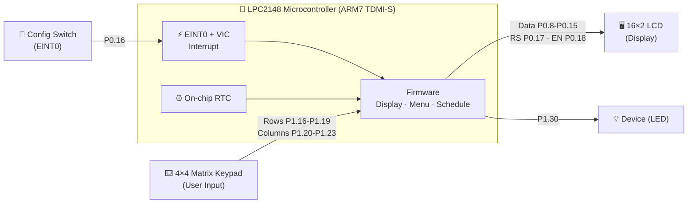
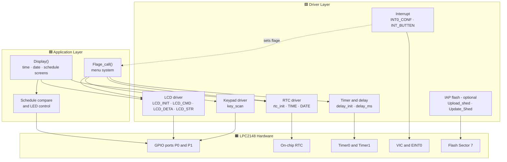
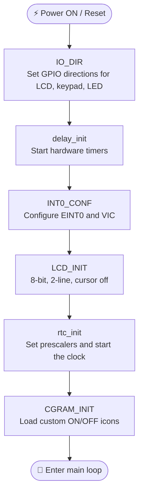
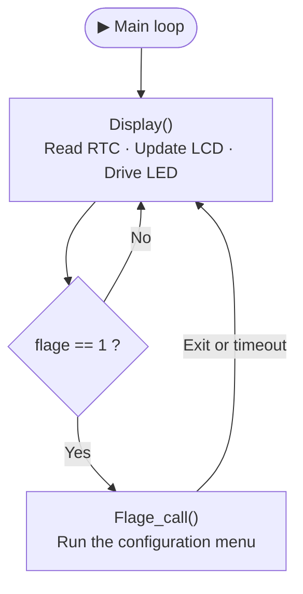
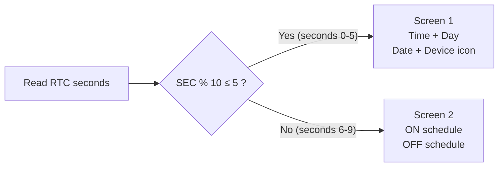
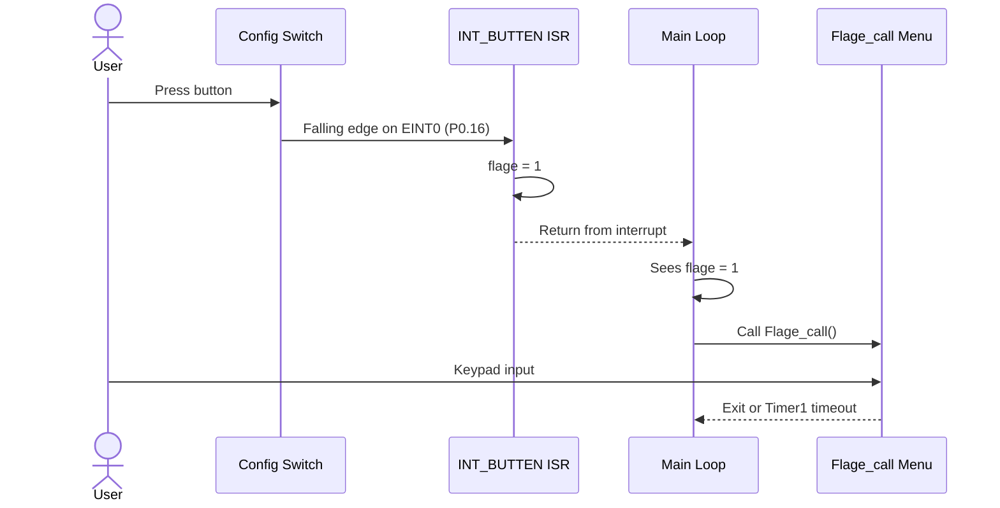
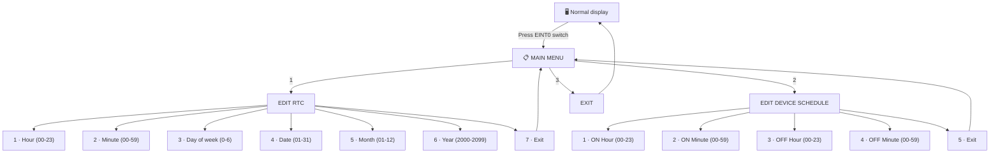
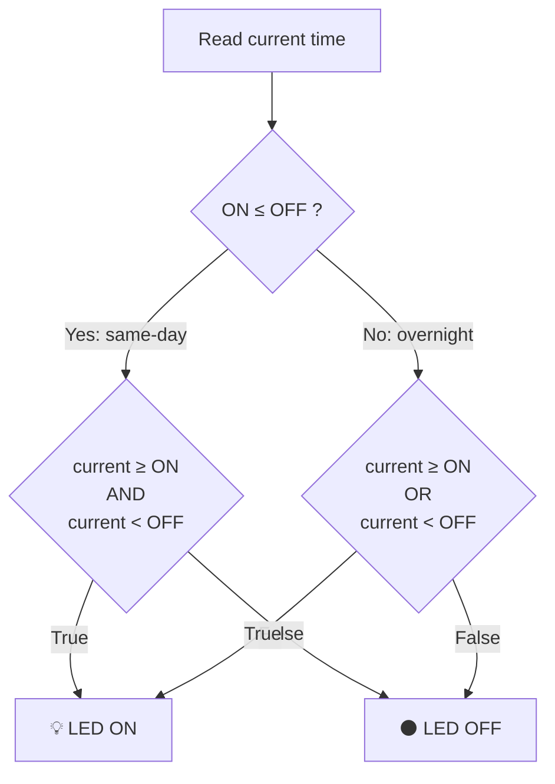
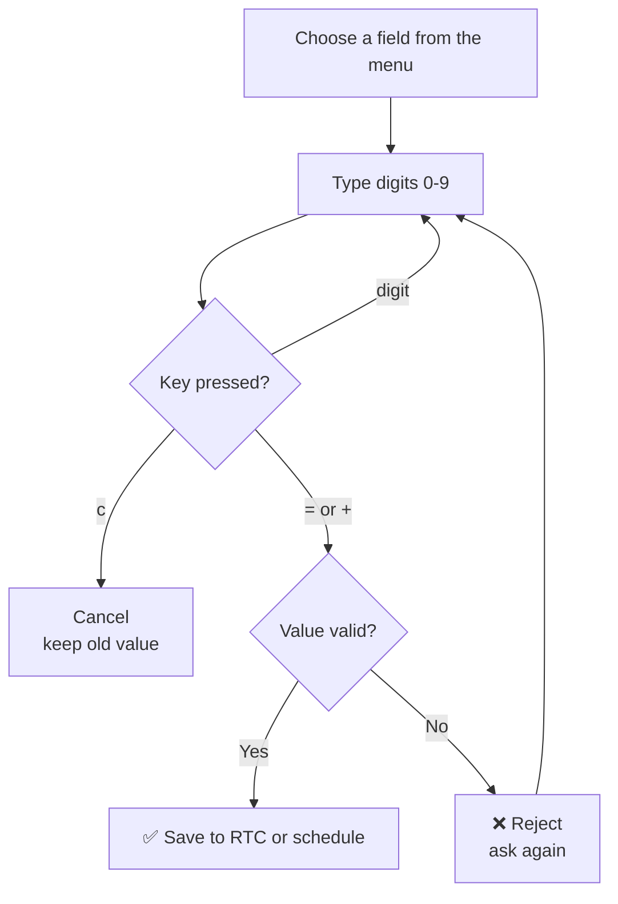

# ⏰ Menu-Driven RTC Configuration and Scheduled Device Control System

-blue)


An embedded automation project built on the **NXP LPC2148 (ARM7 TDMI-S)** microcontroller.

The system shows the **real-time date and time** on a 16×2 LCD. You can **set the clock** and a **daily ON/OFF schedule** using a 4×4 keypad menu. The system then **switches a device automatically** (an LED stands in for the device) according to your schedule.

---

## 🚀 Project at a Glance

| | |
|---|---|
| **What it does** | Shows clock → lets you configure it → controls a device by schedule |
| **Brain** | LPC2148 (ARM7, 60 MHz) with on-chip RTC |
| **Input** | 4×4 keypad + one configuration push-button (EINT0) |
| **Output** | 16×2 LCD + LED (device) |
| **Language / Tool** | Embedded C · Keil µVision · Flash Magic |
| **Source file** | `Menu-Driven-RTC-Scheduled-Device-Control.c` (single file, all drivers included) |

---

## 📑 Table of Contents

- [Aim](#-aim)
- [Objectives](#-objectives)
- [Features](#-features)
- [Block Diagram](#-block-diagram)
- [Hardware Requirements](#-hardware-requirements)
- [Software Requirements](#-software-requirements)
- [Pin Mapping](#-pin-mapping)
- [Circuit Connections](#-circuit-connections)
- [Getting Started](#-getting-started)
- [Firmware Architecture](#-firmware-architecture)
- [Project Workflow](#-project-workflow)
- [What You See on the LCD](#-what-you-see-on-the-lcd)
- [Menu System](#-menu-system)
- [Keypad Guide](#-keypad-guide)
- [Schedule Logic](#-schedule-logic)
- [Input Validation](#-input-validation)
- [Testing Checklist](#-testing-checklist)
- [Troubleshooting](#-troubleshooting)
- [Project Structure](#-project-structure)
- [Source Code Overview](#-source-code-overview)
- [Technical Specifications](#-technical-specifications)
- [Known Limitations](#-known-limitations)
- [Future Enhancements](#-future-enhancements)
- [License](#-license)
- [Acknowledgements](#-acknowledgements)

---

## 🎯 Aim

To develop a **menu-driven RTC configuration and scheduled device control system** using the LPC2148 microcontroller.

The system:
- Displays the current date and time on an LCD
- Lets the user configure RTC settings and device ON/OFF times through keypad-operated menus
- Automatically switches the device ON and OFF according to the user-defined daily schedule

---

## 📋 Objectives

1. Display RTC information (date, time, and day of week) on a 16×2 LCD.
2. Allow users to modify RTC settings (Hour, Minute, Day, Date, Month, Year) using a 4×4 matrix keypad.
3. Provide a way to set the device activation (ON) and deactivation (OFF) times.
4. Control the device state based on the programmed timing schedule.
5. Implement interrupt-driven menu entry (EINT0) with robust input validation.
6. Follow industry-standard embedded programming practices (modular design, proper naming, validation).

---

## ✨ Features

| Feature | Description |
|---------|-------------|
| **Live RTC Display** | Continuously shows `HH:MM:SS`, day of week, and `DD/MM/YYYY` |
| **Alternating Screens** | Switches between the Clock view and the Schedule view every few seconds |
| **Device Status Icons** | Custom CGRAM characters show whether the device is ON or OFF |
| **Interrupt-Driven Menu** | A dedicated switch on EINT0 opens the configuration mode |
| **Edit RTC** | Set Hour (00–23), Minute (00–59), Day (0–6), Date (01–31), Month (01–12), Year (2000–2099) |
| **Edit Device Schedule** | Set ON HH/MM and OFF HH/MM independently |
| **Smart Schedule Logic** | Works for same-day and overnight (across midnight) periods |
| **Strict Validation** | Rejects out-of-range values and identical ON/OFF times |
| **Non-blocking Timeout** | Menu sessions use Timer1 and exit automatically after a timeout |
| **Flash Persistence (IAP)** | Optional storage of the schedule in on-chip Flash Sector 7 |
| **Modular Drivers** | Separate functions for LCD, Keypad, RTC, Timers, Interrupt, IAP |

---

## 🖼️ Block Diagram

### 1) Classic system block diagram

All peripherals connect to the LPC2148 microcontroller.

```
                    ┌─────────────────────────────────┐
                    │          LPC2148                │
┌──────────────┐    │  ┌───────┐                      │    ┌─────────┐
│  4×4 Matrix  │───▶│  │  RTC  │─────────────────────▶│───▶│  16×2   │
│    Keypad    │    │  └───────┘                      │    │   LCD   │
└──────────────┘    │                                 │    └─────────┘
                    │                                 │
┌──────────────┐    │  ┌───────┐                      │    ┌─────────┐
│   Config     │───▶│  │ EINT0 │                      │───▶│ Device  │
│   Switch     │    │  └───────┘                      │    │  (LED)  │
└──────────────┘    │                                 │    └─────────┘
                    └─────────────────────────────────┘
```

### 2) Detailed block diagram (with ports)

> This diagram is drawn with Mermaid. GitHub shows it automatically.



### Signal flow summary

| From | To | Purpose |
|------|----|---------|
| Keypad | LPC2148 | User input for menus and values |
| Config Switch | EINT0 | Menu activation |
| LPC2148 RTC | LCD | Time and date display |
| LPC2148 GPIO | LED | Device ON/OFF control |

---

## 🧩 Hardware Requirements

| Component | Specification / Notes | Qty |
|-----------|-----------------------|-----|
| **LPC2148 Development Board** | ARM7 TDMI-S, 60 MHz (PLL), on-chip RTC | 1 |
| **16×2 Character LCD** | HD44780 compatible, 8-bit interface | 1 |
| **4×4 Matrix Keypad** | Standard membrane or tactile keypad | 1 |
| **LED** | Represents the controlled device / load | 1 |
| **Push Button Switch** | Connected to the EINT0 pin | 1 |
| **USB-UART Converter / DB-9** | For ISP programming and serial debug | 1 |
| **Power Supply** | 5 V regulated | 1 |
| **Potentiometer** | Adjusts LCD contrast (V0 pin) | 1 |
| **Resistor 220 Ω** | Series resistor for the LED | 1 |
| Connecting wires / Breadboard | As required | – |

---

## 💻 Software Requirements

| Tool / Library | Purpose |
|----------------|---------|
| **Keil µVision** (or ARM GCC) | Compile, link, and debug |
| **Flash Magic** | ISP programming of the LPC2148 |
| **lpc21xx.h** | Peripheral register definitions |
| **Embedded C** | Application language |

---

## 📌 Pin Mapping

| Function | LPC2148 Pin | Direction | Notes |
|----------|-------------|-----------|-------|
| LCD Data Bus (D0–D7) | P0.8 – P0.15 | Output | 8-bit parallel interface |
| LCD RS | P0.17 | Output | Register Select |
| LCD EN | P0.18 | Output | Enable strobe |
| Keypad Rows (R0–R3) | P1.16 – P1.19 | Output | Driven one by one |
| Keypad Columns (C0–C3) | P1.20 – P1.23 | Input | Read for key detection |
| Device / LED | P1.30 | Output | HIGH = ON, LOW = OFF |
| Configuration Switch | P0.16 (EINT0) | Input | Edge-triggered external interrupt |

---

## 🔌 Circuit Connections

Connect each part one by one. Tick each box as you finish.

### ✅ 1. 16×2 LCD (HD44780)

```
LPC2148                          16×2 LCD (HD44780)
───────                          ─────────────────
P0.8  ─────────────────────────▶ D0
P0.9  ─────────────────────────▶ D1
P0.10 ─────────────────────────▶ D2
P0.11 ─────────────────────────▶ D3
P0.12 ─────────────────────────▶ D4
P0.13 ─────────────────────────▶ D5
P0.14 ─────────────────────────▶ D6
P0.15 ─────────────────────────▶ D7
P0.17 ─────────────────────────▶ RS
P0.18 ─────────────────────────▶ EN
GND   ─────────────────────────▶ R/W  (tied to GND = write-only)
VCC   ─────────────────────────▶ VCC  (+5 V)
GND   ─────────────────────────▶ GND
POT   ─────────────────────────▶ V0   (contrast)
```

### ✅ 2. 4×4 Matrix Keypad

```
LPC2148                          4×4 KEYPAD
───────                          ──────────
P1.16 ─────────────────────────▶ Row 0
P1.17 ─────────────────────────▶ Row 1
P1.18 ─────────────────────────▶ Row 2
P1.19 ─────────────────────────▶ Row 3
P1.20 ─────────────────────────▶ Col 0
P1.21 ─────────────────────────▶ Col 1
P1.22 ─────────────────────────▶ Col 2
P1.23 ─────────────────────────▶ Col 3
```

### ✅ 3. Device (LED)

```
LPC2148                          DEVICE (LED)
───────                          ────────────
P1.30 ──[220 Ω]──▶ Anode (+) of LED
GND   ───────────▶ Cathode (−) of LED
```

P1.30 **HIGH** → LED **ON** (device active). P1.30 **LOW** → LED **OFF**.

### ✅ 4. Configuration Switch (EINT0)

```
LPC2148                          PUSH BUTTON
───────                          ───────────
P0.16 (EINT0) ─────────────────▶ One terminal of switch
GND           ─────────────────▶ Other terminal of switch
```

An internal pull-up is normally used. Pressing the switch creates a **falling-edge interrupt** on EINT0, which sets the menu-entry flag.

---

## 🏁 Getting Started

Follow these steps in order. It takes about 20 minutes.

### Step 1 — Get the files

```bash
git clone https://github.com/<your-username>/Menu-Driven-RTC-Scheduled-Device-Control.git
cd Menu-Driven-RTC-Scheduled-Device-Control
```

(No Git? Click **Code → Download ZIP** on GitHub and extract it.)

### Step 2 — Collect the hardware

Check the [Hardware Requirements](#-hardware-requirements) table. You need the board, LCD, keypad, LED, push button, USB-UART cable, and a 5 V supply.

### Step 3 — Wire the circuit

Connect everything as shown in [Circuit Connections](#-circuit-connections). Double-check the LCD data pins (D0–D7 → P0.8–P0.15) and the keypad rows and columns.

### Step 4 — Install the software

1. Install **Keil µVision** (with the ARM7 / LPC2148 support).
2. Install **Flash Magic**.

### Step 5 — Create the Keil project

1. **Project → New µVision Project**, and choose a folder.
2. Select the device **NXP → LPC2148**.
3. If Keil asks to copy the startup file to the project, click **Yes**.
4. Add `Menu-Driven-RTC-Scheduled-Device-Control.c` to the **Source Group**.
5. Open **Options for Target (Alt+F7)**:
   - **Target** tab → **Xtal (MHz): 12.0**
   - **Output** tab → tick **Create HEX File**
   - Use MicroLIB (optional)

### Step 6 — Build the project

Press **F7** (Build). When the build shows **0 Error(s)**, a `.hex` file is created.

### Step 7 — Put the board in ISP mode

1. Connect the board to the PC using USB-UART or DB-9.
2. Hold the **ISP** button and press **Reset** (usually).
3. Release both buttons. The chip now waits for programming.

### Step 8 — Flash the HEX file

Open **Flash Magic** and set:

| Setting | Value |
|---------|-------|
| Device | LPC2148 |
| COM Port | The port of your USB-UART converter |
| Baud Rate | 9600 or higher |
| Oscillator (MHz) | 12 |
| Hex File | Browse and select the generated `.hex` |

Click **Start**. When it finishes, **reset the board**.

### Step 9 — First run: see it work

Try this quick test to check that everything is fine.

| # | What to do | What you should see |
|---|------------|---------------------|
| 1 | Power ON | Clock screen with time, day, date |
| 2 | Press the **EINT0 switch** | Main menu appears |
| 3 | Press `1` (EDIT-TIME), then `1` (SET HH) | Board waits for the hour |
| 4 | Type `1` `0`, then press `=` | Hour is saved as 10 |
| 5 | Set the minutes the same way (`2`) | Clock shows your new time |
| 6 | Go back, choose `2` (E_dev_T_she) | Schedule sub-menu |
| 7 | Set **ON** to 1 minute after now, **OFF** to 2 minutes after now | Values accepted |
| 8 | Exit the menus (choose EXIT) | Normal clock screen |
| 9 | Wait 1 minute | **LED turns ON** ✅ |
| 10 | Wait 1 more minute | **LED turns OFF** ✅ |

🎉 If steps 9 and 10 work, your project is running correctly.

---

## 🏗️ Firmware Architecture

The code has three layers. The application uses the drivers. The drivers talk to the hardware.



---

## 🔄 Project Workflow

### 1. System initialization — `INIT()`

Runs once when power is applied.



### 2. Main loop

```c
while(1) {
    Display();          // Update time, date, schedule view and control LED
    if(flage)
        Flage_call();   // Handle menu if the interrupt flag is set
}
```



### 3. Display engine — `Display()`

- Reads the RTC registers (`HOUR`, `MIN`, `SEC`, `DOW`, `DOM`, `MONTH`, `YEAR`)
- Formats them into display strings
- Alternates the LCD content based on the seconds value
- Keeps comparing the current time with the schedule and drives the LED



### 4. Configuration entry (interrupt)

The interrupt routine is very short. It only sets a flag. The main loop does the real work.



---

## 🖥️ What You See on the LCD

**Screen 1 — Clock view** (seconds 0–5 of every 10 seconds)

```
┌────────────────┐
│12:45:30 THU    │   Line 1: HH:MM:SS + 3-letter day
│24/09/2026    ● │   Line 2: DD/MM/YYYY + device status icon
└────────────────┘
```

**Screen 2 — Schedule view** (seconds 6–9)

```
┌────────────────┐
│ON:-09:00:00    │   Device turns ON at this time
│OF:-17:00:00    │   Device turns OFF at this time
└────────────────┘
```

**Screen 3 — Main menu** (after pressing the EINT0 switch)

```
┌────────────────┐
│1.EDIT-TIME    ▲│
│2.E_dev_T_she  ▼│
└────────────────┘
```

> The device icon is a custom character stored in CGRAM. It changes to show whether the device is ON or OFF. The times above are only examples.

---

## 🎛️ Menu System

### Menu map



### Main menu options

| Option | Function | Description |
|--------|----------|-------------|
| 1 | Edit RTC | Change system time and date |
| 2 | Edit Device ON/OFF Times | Set the daily schedule |
| 3 | Exit | Return to normal operation |

### Edit RTC sub-menu

| Option | Field | Valid Range |
|--------|-------|-------------|
| 1 | Hour (HH) | 00 – 23 |
| 2 | Minute (MM) | 00 – 59 |
| 3 | Day of Week | 0 – 6 (Sun – Sat) |
| 4 | Date (DOM) | 01 – 31 |
| 5 | Month | 01 – 12 |
| 6 | Year | 2000 – 2099 |
| 7 | Exit | – |

### Edit Schedule sub-menu

| Option | Field | Valid Range |
|--------|-------|-------------|
| 1 | ON Hour | 00 – 23 |
| 2 | ON Minute | 00 – 59 |
| 3 | OFF Hour | 00 – 23 |
| 4 | OFF Minute | 00 – 59 |
| 5 | Exit | – |

---

## ⌨️ Keypad Guide

### Key layout (as defined in the code)

|  | Col 0 (P1.20) | Col 1 (P1.21) | Col 2 (P1.22) | Col 3 (P1.23) |
|---|:---:|:---:|:---:|:---:|
| **Row 0** (P1.16) | `7` | `8` | `9` | `%` |
| **Row 1** (P1.17) | `4` | `5` | `6` | `*` |
| **Row 2** (P1.18) | `1` | `2` | `3` | `-` |
| **Row 3** (P1.19) | `c` | `0` | `=` | `+` |

### What each key does

| Key | In menus | While typing a number |
|-----|----------|-----------------------|
| `0` – `9` | Select the menu option with that number | Enter a digit (shown on the LCD) |
| `+` | Scroll down | **Confirm** the value |
| `-` | Scroll up | – |
| `=` | – | **Confirm** the value |
| `c` | Cancel / exit | **Cancel** and keep the old value |

### Configuration switch (EINT0)

| Action | Result |
|--------|--------|
| Press the switch | EINT0 interrupt → `flage = 1` → main menu opens |

### Quick reference

| Action | Keys / Method | Result |
|--------|---------------|--------|
| View current time and date | Automatic | Default screen |
| View ON / OFF schedule | Automatic (alternates) | Schedule screen |
| Enter configuration menu | Press EINT0 switch | Menu appears |
| Scroll menu up / down | `-` / `+` | Changes displayed options |
| Select a menu item | `1`, `2` or `3` | Opens sub-menu or exits |
| Enter a numeric value | `0` – `9` | Value appears on LCD |
| Confirm an entry | `=` or `+` | Value accepted if valid |
| Cancel an entry | `c` | Value discarded |
| Exit any menu | Select EXIT or wait for timeout | Back to normal mode |

---

## ⏱️ Schedule Logic

The device is controlled by these rules:

1. **ON time is inclusive. OFF time is exclusive.**
   Example: ON = 09:00, OFF = 17:00 → the device is ON from 09:00:00 until 16:59:59.
2. **Same-day schedule** (ON ≤ OFF): the device is ON when `current ≥ ON` **AND** `current < OFF`.
3. **Overnight schedule** (ON > OFF): the device is ON when `current ≥ ON` **OR** `current < OFF`.
   Example: ON = 22:00, OFF = 06:00 → runs from 22:00 until 05:59 the next morning.
4. **Identical ON and OFF times are rejected**, because the operating period would be unclear.
5. The schedule **repeats every day**.

### Decision flowchart



### 24-hour timeline examples

`█` = device ON, `░` = device OFF (one character = one hour)

```
Hour             0  3  6  9  12 15 18 21
                 ↓  ↓  ↓  ↓  ↓  ↓  ↓  ↓
Same-day         ░░░░░░░░░████████░░░░░░░     ON = 09:00   OFF = 17:00
Overnight        ██████░░░░░░░░░░░░░░░░██     ON = 22:00   OFF = 06:00
```

---

## ✅ Input Validation

| Field | Validation Performed |
|-------|----------------------|
| Hour | 0 – 23 |
| Minute | 0 – 59 |
| Day of Week | 0 – 6 |
| Date (DOM) | 1 – 31 (basic check; month length and leap year can be added later) |
| Month | 1 – 12 |
| Year | 2000 – 2099 |
| ON / OFF times | Range check + rejected if ON equals OFF |
| Numeric entry | Only digits accepted; cancel with `c`; confirm with `=` or `+` |

Invalid entries are rejected and the user must enter a valid value again. **Nothing is changed in the RTC or the schedule until a valid value is confirmed.**



---

## 🧪 Testing Checklist

Use this table to check that the project works. Tick each row after testing.

| # | Test | Expected Result | Pass |
|---|------|-----------------|:----:|
| 1 | Power ON the board | Clock screen appears on LCD | ☐ |
| 2 | Wait 10 seconds | Screen alternates between Clock and Schedule views | ☐ |
| 3 | Press the EINT0 switch | Main menu opens | ☐ |
| 4 | Set Hour = `24` | **Rejected**, old value kept | ☐ |
| 5 | Set Minute = `60` | **Rejected**, old value kept | ☐ |
| 6 | Set Month = `13` | **Rejected**, old value kept | ☐ |
| 7 | Set Year = `1999` | **Rejected**, old value kept | ☐ |
| 8 | Set Hour = `10`, confirm with `=` | Clock shows the new hour | ☐ |
| 9 | Start typing a value, then press `c` | Entry cancelled, old value kept | ☐ |
| 10 | Set ON = 09:00 and OFF = 09:00 | **Rejected** (identical times) | ☐ |
| 11 | ON = 09:00, OFF = 17:00, time = 12:00 | LED **ON** | ☐ |
| 12 | ON = 09:00, OFF = 17:00, time = 18:00 | LED **OFF** | ☐ |
| 13 | ON = 22:00, OFF = 06:00, time = 23:30 | LED **ON** | ☐ |
| 14 | ON = 22:00, OFF = 06:00, time = 03:00 | LED **ON** | ☐ |
| 15 | ON = 22:00, OFF = 06:00, time = 12:00 | LED **OFF** | ☐ |
| 16 | Open the menu and do nothing | Menu closes by itself after the timeout | ☐ |

---

## 🛠️ Troubleshooting

| Problem | Possible Cause | What to Do |
|---------|----------------|------------|
| LCD is blank or shows only dark boxes | Contrast not set | Turn the potentiometer on the **V0** pin; check VCC and GND |
| LCD shows wrong / garbage characters | Data wires in wrong order | Check D0–D7 → P0.8–P0.15, and RS (P0.17) / EN (P0.18) |
| Flash Magic cannot connect | Board is not in ISP mode, or wrong settings | Hold ISP and press Reset; check COM port, baud rate, and oscillator = 12 MHz |
| Keypad keys give wrong digits or nothing | Rows / columns swapped or loose | Rows → P1.16–P1.19, Columns → P1.20–P1.23; compare with the [key layout](#-keypad-guide) |
| Menu does not open | Switch wiring problem | Switch between **P0.16** and **GND**; press firmly |
| LED never turns ON | Schedule not set, or LED wiring | Look at the schedule screen; check the 220 Ω resistor, LED direction, and P1.30 |
| Time or date is wrong after power off | Clock must be set again | Set it from the menu (backup options are in [Future Enhancements](#-future-enhancements)) |
| Menu closes too quickly | Timeout is short | Adjust the `delay_ms1()` calls in the code |

---

## 📁 Project Structure

```
Menu-Driven-RTC-Scheduled-Device-Control/
│
├── Menu-Driven-RTC-Scheduled-Device-Control.c              # Complete single-file application source
├── README.md                   # This documentation
│
└── docs/
    └── Menu-Driven RTC Configuration and Scheduled Device Control System.pdf
```

> The provided implementation is a **single-file** design that contains all drivers and application logic. For production use, split it into modules (`lcd.c/h`, `keypad.c/h`, `rtc.c/h`, and so on).

---

## 🔍 Source Code Overview

### Major modules inside `Menu-Driven-RTC-Scheduled-Device-Control.c`

| Module / Function Group | Purpose |
|-------------------------|---------|
| **Clock and Constants** | FCLK, CCLK, PCLK, RTC prescalers, pin definitions |
| **LCD Driver** | `LCD_INIT`, `LCD_CMD`, `LCD_DETA`, `LCD_STR`, `CGRAM_INIT` |
| **RTC Driver** | `rtc_init`, `TIME`, `DAY`, `DATE`, `Update_Time`, `Update_Date` |
| **Keypad Driver** | `key_scan`, `col_scan`, `row_scan` |
| **Interrupt** | `INT0_CONF`, `INT_BUTTEN` (ISR) |
| **Timers / Delay** | `delay_init`, `delay_ms`, `delay_ms1` |
| **Display and Control Logic** | `Display`, schedule comparison, LED control |
| **Menu System** | `Flage_call`, `Edit_Time`, `Edit_Sehd`, `Show_*_Menu`, `Get_Num_Input` |
| **IAP / Flash** | `Upload_shed`, `Update_Shed` (Sector 7) |

### Key global variables

| Variable | Use |
|----------|-----|
| `Time[]`, `Date[]` | Display buffers |
| `RTC_SHED_START[]`, `RTC_SHED_END[]` | Schedule strings |
| `flage` | Interrupt flag for menu entry |
| `KPM[4][4]` | Keypad character map |
| `MENU`, `TIME_MENU`, `SHED_MENU` | Menu text arrays |

---

## ⚙️ Technical Specifications

| Parameter | Value |
|-----------|-------|
| Microcontroller | NXP LPC2148 (ARM7 TDMI-S) |
| System Clock (CCLK) | 60 MHz (PLL from 12 MHz crystal) |
| Peripheral Clock (PCLK) | 15 MHz |
| RTC Clock Source | 32.768 kHz (prescaled) |
| LCD Interface | 8-bit parallel (HD44780) |
| Keypad | 4×4 matrix scanning |
| Interrupt | EINT0, edge-triggered, VIC vectored |
| Timers Used | Timer0 (blocking delay), Timer1 (menu timeout) |
| Flash Sector for Schedule | Sector 7 (0x00007000), optional IAP |
| Programming Interface | ISP via UART (Flash Magic) |

---

## ⚠️ Known Limitations

- Date-of-Month validation is basic (1–31). Full month-length and leap-year checking can be added.
- The schedule is mainly held in RAM. Flash write through IAP is implemented but is optional and not active in the main flow.
- The menu timeout is controlled by `delay_ms1()` calls (adjustable).
- The code uses a single-file design for simplicity. Splitting into several source and header files is recommended for larger projects.

---

## 🚀 Future Enhancements

- Full calendar validation (days per month + leap years)
- Multiple daily schedules or weekly schedules
- Password protection for the configuration menu
- UART logging of events
- Soft RTC backup or battery-backed external RTC (DS1307)
- EEPROM / Flash storage of multiple profiles
- Buzzer or extra status LEDs
- Modular multi-file project structure with Makefiles

---
## Author

**Jithendra Sadineni**

</div>
